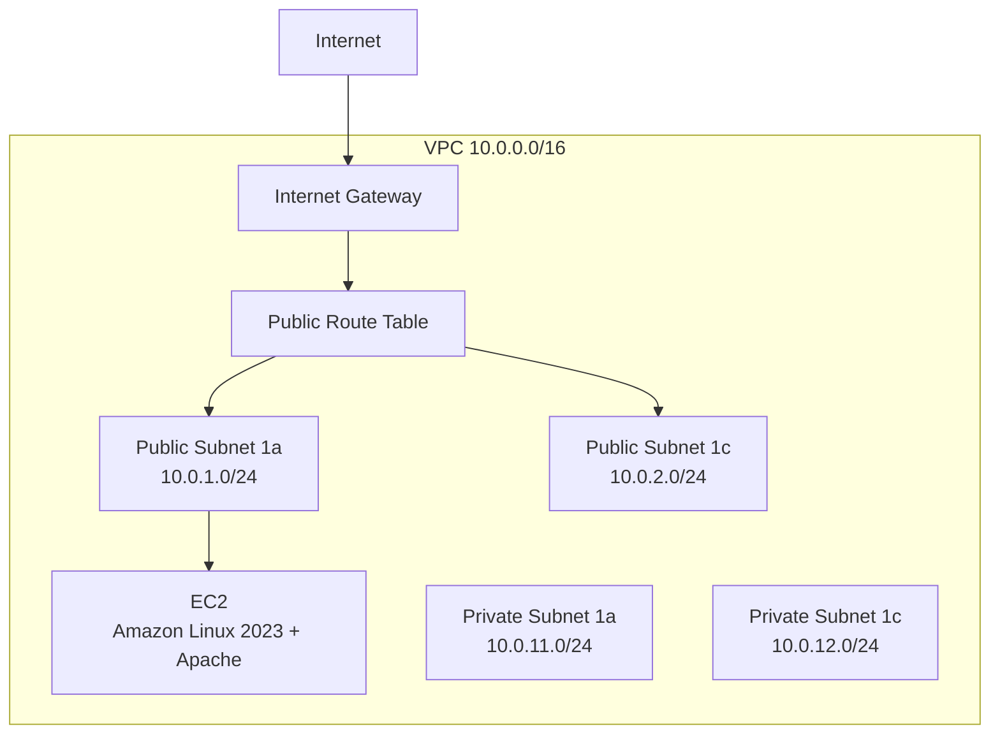
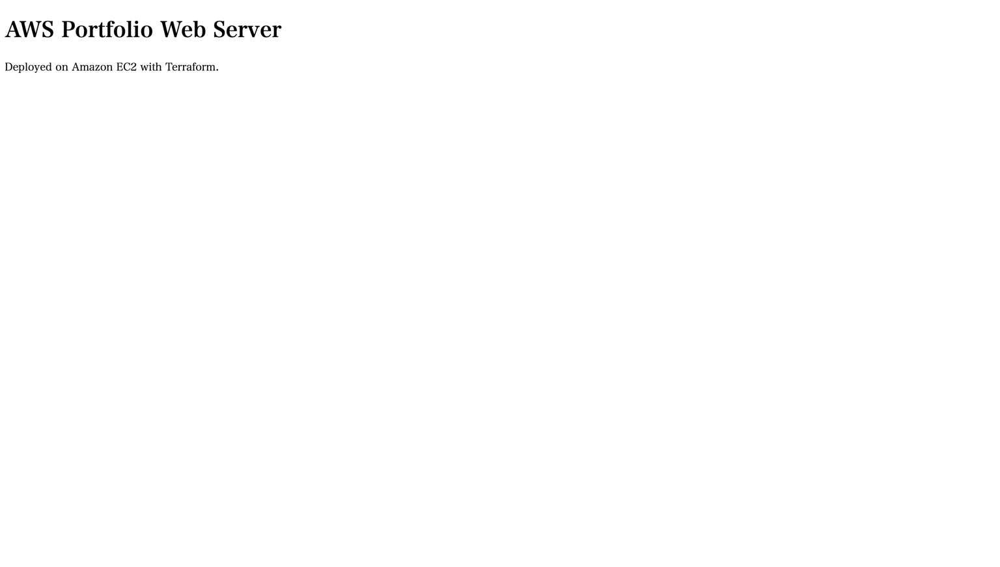
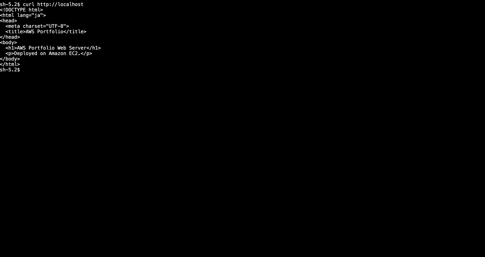

# AWS Terraform Web Portfolio v1

Terraformで、東京リージョンに小規模なWebサーバー環境を構築する学習用ポートフォリオです。

## 構成

- VPC: `10.0.0.0/16`
- 2つのAvailability Zone
- Publicサブネット2個、Privateサブネット2個
- Internet GatewayとPublicルートテーブル
- Amazon Linux 2023 / ApacheのEC2 1台
- HTTP（80番）のみインバウンド許可
- SSHは開放せず、Systems Manager Session Managerを利用
- EBS暗号化、IMDSv2必須

## 認証

長期アクセスキーは使用せず、AWS CLIのブラウザログインによる一時認証を使用します。

```bash
aws login --profile portfolio --region ap-northeast-1
```

## 実行方法

```bash
terraform init
terraform fmt -check
terraform validate
terraform plan
terraform apply
```

適用後、出力された`web_url`をブラウザで開きます。

## 削除

動作確認後は課金を抑えるため、環境を削除します。

```bash
terraform destroy
```

## セキュリティ上の注意

- `.tfstate`、アクセスキー、秘密鍵はGitHubへコミットしません。
- SSH（22番）はインターネットへ開放しません。
- v1では動作確認のためHTTPを公開しています。HTTPS、ALB、Auto Scalingは次版で追加予定です。

## 構成図



## 動作確認

### Terraformによる再構築後のHTTP表示



### 手動構築時のSession Manager接続確認

SSHポートを開放せず、Systems Manager Session Manager経由で接続し、Apacheの応答を確認しました。


